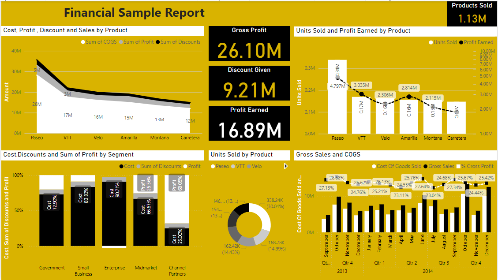

# Power BI Report: Financial Analysis of Microsoft

This report analyzes the financial performance of Microsoft Corporation, one of the world's leading technology companies. It uses data from the [Financial Sample Excel workbook](^1^), which contains sales and profit data sorted by market segment and country/region.

## Report Overview

The report consists of four pages:

- **Dashboard**: A summary of key financial metrics and trends, such as revenue, profit, gross margin, operating income, and sales growth rate. It also includes a slicer to filter the data by market segment.
- **Sales Analysis**: A detailed breakdown of sales by product, region, channel, and customer segment. It also shows the average transaction value and the sales distribution across different categories.
- **Profit Analysis**: A comprehensive view of profit by product, region, channel, and customer segment. It also shows the operating income and margin, and the profit distribution across different categories.
- **Gross Margin Analysis**: An in-depth look at gross margin by product, region, channel, and customer segment. It also shows the cost of goods sold (COGS) and the gross margin percentage.

## How to Use

- Clone or download this repo to your local machine.
- Open the .pbix file of the report in Power BI Desktop.
- Connect to your own data source or use the sample data provided.
- Publish the report to the Power BI service or share it with others.

## Images

The following images show the visuals used in the report:

- Dashboard: 
- Sales Analysis: 
- Profit Analysis: 
- Gross Margin Analysis: 
